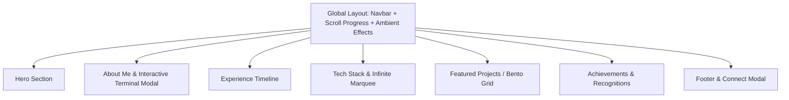

# Design Specification: Aditya Hota Portfolio

> **Target Platform**: [stitch.withgoogle.com](https://stitch.withgoogle.com)  
> **Project Type**: Personal Developer Portfolio & Creative Showcase  
> **Tech Stack Focus**: Next.js 16, React 19, Tailwind CSS v4, Framer Motion, Three.js / R3F, Lucide Icons, Radix UI  

---

## 1. Overview & Aesthetics

- **Owner**: Aditya Hota (Full Stack Developer & DevOps Engineer)
- **Concept**: Sleek, modern tech portfolio featuring glassmorphism, fluid micro-interactions, dark/light theme toggle, ambient particles, and interactive bento components.
- **Design Vibe**: High-tech minimalism meets creative developer tool aesthetic (futuristic terminal accents, glowing borders, smooth spring transitions).

---

## 2. Design System & Theme Tokens

### Color Palette

| Token | Dark Mode (Default) | Light Mode | Usage |
|---|---|---|---|
| **Background** | `#090d16` / `hsl(222, 47%, 6%)` | `#f8fafc` / `hsl(210, 40%, 98%)` | Page background |
| **Foreground** | `#f1f5f9` / `hsl(210, 40%, 98%)` | `#0f172a` / `hsl(222, 47%, 11%)` | Primary text & headings |
| **Muted / Subtle** | `#94a3b8` / `hsl(215, 20%, 65%)` | `#64748b` / `hsl(215, 16%, 47%)` | Subtitles, dates, meta text |
| **Accent / Highlight** | `#3b82f6` (Cyan-Blue) / `#6366f1` | `#2563eb` / `#4f46e5` | Active indicators, ping dots, glow borders |
| **Glass Card Bg** | `rgba(15, 23, 42, 0.6)` | `rgba(255, 255, 255, 0.7)` | Cards, Modals, Navbar overlay |
| **Border** | `rgba(255, 255, 255, 0.1)` | `rgba(0, 0, 0, 0.08)` | Dividers, card frames |

### Typography

- **Headings (Sans)**: Inter / System Sans-Serif — Tight tracking (`tracking-tighter`), bold weights (`font-bold`), sizes `text-3xl` to `text-6xl`.
- **Subtitles & Tags (Mono)**: JetBrains Mono / Fira Code — Uppercase, wide tracking (`tracking-widest` / `tracking-[0.3em]`), text sizes `text-xs` to `text-sm`.
- **Body**: System Sans — `text-base` / `text-lg`, relaxed line-height.

---

## 3. Key Layout Components & Structure

### 3.1 Sticky Navbar & Header
- **Logo**: `Aditya Hota` with a glowing accent dot animation.
- **Nav Links**: `About Me`, `Experience`, `Projects`, `Achievements`, `Contact`.
- **Actions**: Theme Toggle button (Sun/Moon), Resume PDF Button (`/newResume.pdf`), Mobile Drawer Toggle.

### 3.2 Hero Section
- **Background**: Ambient 3D canvas / `SentientSphere` particle mesh with interactive mouse follower.
- **Title**: Large bold typography (`Full Stack Developer & DevOps Engineer`).
- **Subtitle**: *"Designing products that scale, ship, and last"*.
- **Quick Links**: Interactive social icon pills (GitHub, LinkedIn, Twitter/X, Email) with hover tooltips and glow effects.

### 3.3 About Me & Interactive Terminal
- **Profile Layout**: Circular avatar with spring hover rotation alongside a bulleted summary.
- **Summary**: CS & Engineering undergrad, Kubernetes autoscaling researcher, GDG Web Lead, multi-hackathon winner.
- **Interactive Terminal**: Terminal interface trigger launching an interactive CLI emulator for exploring resume details.

### 3.4 Experience Timeline
- **Layout**: Vertical timeline with connecting line (`md:grid-cols-2`).
- **Cards**: Glassmorphism cards with glowing borders (`GlowingBorder`), company names (e.g. *Batoi Systems*), role details, and tech tag chips.

### 3.5 Tech Stack & Marquee
- **Infinite Marquee**: Continuous dual-direction scroll ribbon showcasing technology badges (React, Next.js, Docker, Kubernetes, Tailwind, Python, Go, Node.js).
- **Categorized Grid**: Filterable tabs for Frontend, Backend, Cloud/DevOps, Tools & Systems.

### 3.6 Featured Projects (Works Showcase)
- **Bento Grid Layout**: Asymmetric responsive grid with rich project cards.
- **Card Elements**: High-res preview thumbnail, live demo link, GitHub repo link, tech tag pill badges, interactive drawer/modal trigger.

### 3.7 Achievements & Awards
- **Grid Layout**: Metric & trophy cards (e.g., Grand Finalist, Research Paper Co-author, GDG Lead).
- **Icons**: Lucide icons (`Trophy`, `Medal`, `Star`, `FileText`) with gradient backdrop glows.

### 3.8 Contact Drawer & Footer
- **Floating Action Button**: Fixed bottom-right `Connect` CTA button.
- **Modal**: Interactive contact modal with name, email, message form, and social links.
- **Footer**: Copyright info, social links, back-to-top smooth scroll action.

---

## 4. Prompt Specifications for Google Stitch

When importing into **[stitch.withgoogle.com](https://stitch.withgoogle.com)**, use the following structured prompt directives:

1. **Theme Directives**: *"Dark theme high-tech developer portfolio layout with glassmorphism cards, glowing accent borders, and clean monospace metadata text."*
2. **Layout Structure**: *"Top sticky header with backdrop blur, full-screen hero section with bold headline typography, 2-column experience timeline, 3-column project bento grid, and a floating contact button."*
3. **Interactive Elements**: *"Include hover scale effects, pill badges for tech stack tags, filterable category tabs, and terminal window styling with mock command prompts."*
4. **Color Tokens**: *"Primary bg #090d16, card glass bg rgba(15,23,42,0.6), accent glow #3b82f6."*
